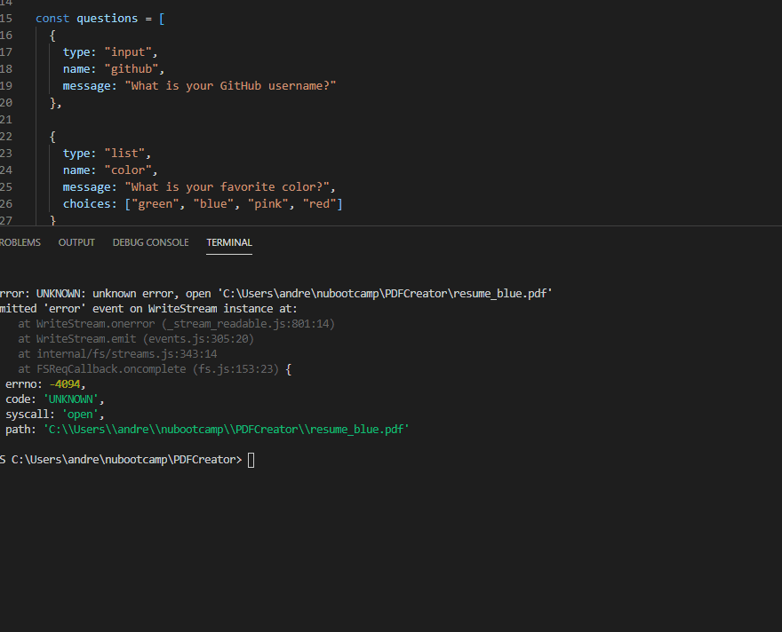

# DeveloperPDFGenerator
This repository contains files that use node js modules to obtain developer username on github, then proceeds to ask their favorite color. Using information contained on their github accounts, it generates a PDF file with links to their github account, LinkedIN, and several details as number of stars and followers.

